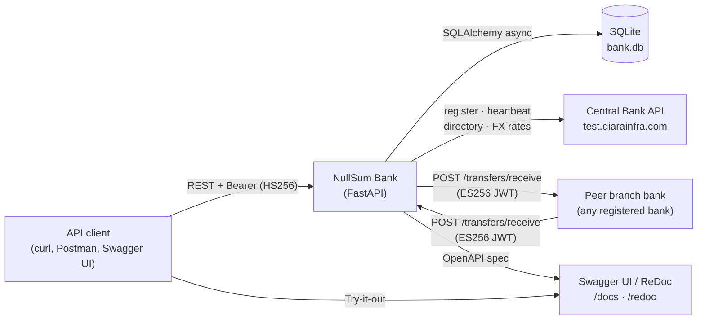
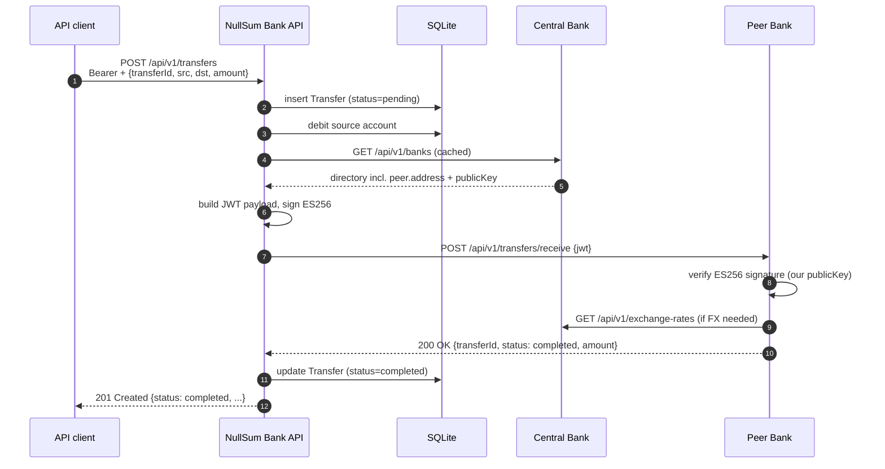

# Integrations

This document describes how the **NullSum Bank** branch API integrates with the systems around it: end-user clients, its local database, the Central Bank, peer branch banks, and Swagger UI. All claims here reference the actual implementation in this repository — see the file paths in parentheses.

> Companion to [README.md](README.md). The README covers installation and usage; this file covers integration architecture, security and protocol details.

---

## 1. Integrated systems

| # | System | Role | Where in code |
|---|---|---|---|
| 1 | **API client** (curl, Postman, Swagger UI, frontend app) | Calls our REST endpoints to register users, manage accounts, and initiate transfers. | [app/routers/](app/routers/) |
| 2 | **SQLite database** (`./bank.db`) | Local persistence for users, accounts, transfers, and bank registration state. Async access via SQLAlchemy + aiosqlite. | [app/database.py](app/database.py), [app/models.py](app/models.py) |
| 3 | **Central Bank API** (`https://test.diarainfra.com/central-bank`) | Bank registration, periodic heartbeat, peer bank directory, exchange rates. | [app/services/central_bank_service.py](app/services/central_bank_service.py) |
| 4 | **Peer branch banks** | Counterparties for inter-bank transfers. We send signed JWTs to their `/transfers/receive` endpoint and accept signed JWTs at our own. | [app/services/transfer_service.py](app/services/transfer_service.py) |
| 5 | **Swagger UI / ReDoc** (FastAPI built-in) | Interactive API explorer and test client. Mounted at `/docs` and `/redoc`. | [app/main.py:117-123](app/main.py#L117-L123) |

---

## 2. Integration points

### 2a. Endpoints we expose

| Method | Path | Purpose | Auth |
|---|---|---|---|
| `POST` | `/api/v1/users` | Register a new user, return Bearer token. | None |
| `GET`  | `/api/v1/users/{userId}` | Return own user profile. | Bearer (HS256) |
| `POST` | `/api/v1/users/{userId}/accounts` | Create an account for the authenticated user. | Bearer (HS256) |
| `GET`  | `/api/v1/accounts/{accountNumber}` | Public account lookup (number, owner name, currency). | None |
| `POST` | `/api/v1/transfers` | Initiate an intra-bank or inter-bank transfer. | Bearer (HS256) |
| `POST` | `/api/v1/transfers/receive` | Accept an inter-bank transfer from another branch bank. | ES256 JWT in body |
| `GET`  | `/api/v1/transfers/{transferId}` | Get status of one's own transfer. | Bearer (HS256) |
| `GET`  | `/health` | Liveness probe. | None |

Source files: [app/routers/users.py](app/routers/users.py), [app/routers/accounts.py](app/routers/accounts.py), [app/routers/transfers.py](app/routers/transfers.py), [app/main.py:162-165](app/main.py#L162-L165).

### 2b. Endpoints we consume on the Central Bank

| Method | Path | Purpose | Function |
|---|---|---|---|
| `POST` | `/api/v1/banks` | Register this branch bank. Sends `{name, address, publicKey}`; receives assigned `bankId`. | [`register_with_central_bank`](app/services/central_bank_service.py#L60) |
| `POST` | `/api/v1/banks/{bankId}/heartbeat` | Periodic liveness signal. Body: `{timestamp}`. | [`send_heartbeat`](app/services/central_bank_service.py#L114) |
| `GET`  | `/api/v1/banks` | Fetch the directory of all registered banks (used to find peers and their public keys). | [`get_banks_directory`](app/services/central_bank_service.py#L146) |
| `GET`  | `/api/v1/exchange-rates` | Fetch FX rates for currency conversion on incoming inter-bank transfers. | [`get_exchange_rates`](app/services/central_bank_service.py#L185) |

### 2c. Endpoint we consume on peer branch banks

| Method | Path | Purpose | Function |
|---|---|---|---|
| `POST` | `{peer.address}/api/v1/transfers/receive` | Deliver a signed inter-bank transfer JWT. | [`_do_external_transfer`](app/services/transfer_service.py#L76), [`retry_pending_transfers`](app/services/transfer_service.py#L436) |

The peer's address and public key are looked up from the Central Bank's directory by 3-letter prefix (the first 3 characters of the destination account number).

---

## 3. Integration methods

- **Transport**: REST over HTTP(S). All bodies are JSON (Pydantic-validated request/response schemas in [app/schemas.py](app/schemas.py)).
- **HTTP methods used**: `GET`, `POST`. The current API does not use `PUT`, `PATCH`, or `DELETE` — accounts and transfers are not mutable resources from the client's perspective.
- **HTTP client (outbound)**: `httpx.AsyncClient` with explicit timeouts (15–30 s) for every Central Bank and peer-bank call.
- **Authentication mechanisms** (details in §4):
  - **HS256 Bearer tokens** for end-user endpoints — signed with `SECRET_KEY`, 30-day expiry by default.
  - **ES256 JWTs** (ECDSA on curve P-256) for inter-bank payment messages — signed with our private key, verified with the sender's public key from the Central Bank directory.
- **Background processes** ([app/main.py](app/main.py)):
  - **Heartbeat loop** — fires once 10 s after startup, then every **25 minutes** thereafter (`HEARTBEAT_INTERVAL_SECONDS`, [main.py:19](app/main.py#L19)). The early first beat prevents the bank from being expired during a restart (issue #13).
  - **Retry loop** — every **60 seconds** scans `transfers` for `status = 'pending'` and re-sends any whose `next_retry_at` has elapsed. Backoff is exponential `2^retry_count` minutes, capped at **60 minutes** ([transfer_service.py:44-46](app/services/transfer_service.py#L44-L46)). After **4 hours** with no success, the transfer is marked `failed_timeout` and the source account is refunded ([transfer_service.py:447-463](app/services/transfer_service.py#L447-L463)).
- **Caching**: the bank directory and exchange rates are cached in the `bank_state` table ([models.py](app/models.py)). On a Central Bank outage, the cached copy is used as a fallback ([central_bank_service.py:163-166](app/services/central_bank_service.py#L163-L166)).
- **Swagger UI as a test client**: with the auto-generated OpenAPI spec at [`/openapi.json`](http://localhost:8000/openapi.json), the interactive `/docs` page acts as a working REST client. It also accepts the Bearer token via the **Authorize** button so protected endpoints can be exercised directly from the browser.

---

## 4. Security rules

### When a Bearer token is required

| Endpoint | Bearer required? |
|---|---|
| `POST /api/v1/users` | No (used to obtain the token) |
| `GET /api/v1/users/{userId}` | **Yes** |
| `POST /api/v1/users/{userId}/accounts` | **Yes** |
| `GET /api/v1/accounts/{accountNumber}` | No (public lookup; only number, owner name, currency — no balance) |
| `POST /api/v1/transfers` | **Yes** |
| `GET /api/v1/transfers/{transferId}` | **Yes** |
| `POST /api/v1/transfers/receive` | No Bearer — the body's signed JWT is the proof of origin |
| `GET /health` | No |

### How user-scoped endpoints are protected

Protected routes use the `get_current_user` dependency ([auth.py:73-91](app/auth.py#L73-L91)), which:

1. Reads the `Authorization: Bearer <token>` header (`HTTPBearer` scheme).
2. Verifies the HS256 signature against `SECRET_KEY` and checks expiry.
3. Loads the corresponding user from the database; rejects with **401** if the token is invalid, expired, or refers to an unknown user.

Each handler then enforces **ownership**:

- A user can only view their own profile ([routers/users.py:60-64](app/routers/users.py#L60-L64)).
- A user can only create accounts under their own `userId` ([routers/accounts.py:35-39](app/routers/accounts.py#L35-L39)).
- A user can only initiate a transfer from an account they own ([transfer_service.py:206-211](app/services/transfer_service.py#L206-L211)).
- A user can only query the status of a transfer whose source account they own ([transfer_service.py:419-429](app/services/transfer_service.py#L419-L429)).

Ownership violations return **403 Forbidden** (not 404) to distinguish them from "not found" cases.

### How inter-bank transfers are signed

Outbound (`_do_external_transfer`, [transfer_service.py:101-112](app/services/transfer_service.py#L101-L112)):

1. Build a JWT payload:
   ```json
   {
     "transferId":         "<uuid>",
     "sourceAccount":      "<our 8-char account>",
     "destinationAccount": "<peer 8-char account>",
     "amount":             "<decimal string>",
     "currency":           "<ISO 4217>",
     "sourceBankId":       "<our bankId>",
     "destinationBankId":  "<peer bankId>",
     "timestamp":          "<ISO-8601 UTC>",
     "nonce":              "<uuid>"
   }
   ```
2. Sign with our private key, algorithm **ES256** ([`sign_interbank_jwt`](app/auth.py#L96)).
3. POST `{ "jwt": "<signed-jwt>" }` to the peer's `/api/v1/transfers/receive`.

Inbound (`receive_interbank_transfer`, [transfer_service.py:276-314](app/services/transfer_service.py#L276-L314)):

1. Decode the JWT header **without verifying** to extract `sourceBankId` (401 if missing or undecodable).
2. Look up the source bank in the Central Bank directory by 3-letter prefix (403 if unknown).
3. Verify the JWT signature with the source bank's public key from the directory (401 on signature failure).
4. Validate required claims and credit the destination account; the JWT itself is the authorization.

### Where the private key lives

- Generated on first boot by `ensure_keys()` ([auth.py:23-44](app/auth.py#L23-L44)) using `cryptography.hazmat.primitives.asymmetric.ec.SECP256R1`.
- Written to `./keys/private_key.pem` (path configurable via the `KEYS_DIR` env var). The matching `public_key.pem` sits next to it.
- The **private key never leaves the host** — only the public key is uploaded, once, in the registration request body. The directory `./keys/` is in `.gitignore`.
- For local dev only: the `BANK_ID` env var ([main.py:57-60](app/main.py#L57-L60)) lets you skip Central Bank registration and use a fixed prefix. **It must be empty in production.**

### What MUST NOT be logged

- Bearer tokens (raw `Authorization` header values).
- Inter-bank JWTs (the full signed payload) or any individual claim that uniquely identifies it (e.g. `nonce`, full payload dump).
- Private key material — never read it into a log line under any circumstance.
- User PII beyond what is strictly necessary for an error message (no email, no full name in error logs).
- Account balances in error logs.

What IS logged today: bank IDs, transfer IDs, error categories, HTTP status codes from outbound calls, and Central Bank response bodies on failure (operational debugging only — no auth material). See the `logger.*` calls grepped from [app/main.py](app/main.py), [app/services/central_bank_service.py](app/services/central_bank_service.py), and [app/services/transfer_service.py](app/services/transfer_service.py).

### Idempotency — preventing double transfers

The client supplies a `transferId` (UUID) on every `POST /api/v1/transfers`. This value is the **primary key** of the `transfers` table ([models.py:27-42](app/models.py#L27-L42)).

- On `POST /api/v1/transfers`, if a row with that `transferId` already exists, the request is rejected with **409 Conflict** — `TRANSFER_ALREADY_PENDING` if it is still pending, otherwise `DUPLICATE_TRANSFER` ([transfer_service.py:179-193](app/services/transfer_service.py#L179-L193)). No money is moved twice.
- On `POST /api/v1/transfers/receive`, an existing row with the JWT's `transferId` causes the existing record to be returned without crediting again ([transfer_service.py:330-335](app/services/transfer_service.py#L330-L335)).
- Outbound retries from the retry loop reuse the same `transferId` so the receiving bank can detect and discard duplicates the same way.

### HTTP status codes used for errors

| Status | Meaning | Example use |
|---|---|---|
| **200** | OK | `POST /transfers/receive` success |
| **201** | Created | `POST /users`, `POST /accounts`, `POST /transfers` success |
| **400** | Bad request — malformed input | Invalid amount, missing JWT fields |
| **401** | Unauthorized — missing/invalid Bearer or invalid JWT signature | Expired token, bad ES256 signature |
| **403** | Forbidden — authenticated but not allowed | Trying to view another user's profile, transfer from someone else's account, unknown source bank in incoming JWT |
| **404** | Not found | Unknown user, account, or transfer |
| **409** | Conflict | Duplicate email at registration; duplicate `transferId` |
| **422** | Unprocessable — semantically invalid | Insufficient funds; Pydantic validation errors |
| **500** | Internal error | Unhandled exception (logged with full traceback) |
| **503** | Service unavailable | Currency conversion failed because Central Bank rates are unreachable |

All error responses follow a uniform body shape `{ "code": "<MACHINE_CODE>", "message": "<human text>" }`, normalized by the global exception handlers in [main.py:128-152](app/main.py#L128-L152).

---

## 5. Diagrams

### 5a. System context



### 5b. Inter-bank transfer happy path



### 5c. Endpoint → counterpart system

| Endpoint | Counterpart system | Method | Auth | Purpose |
|---|---|---|---|---|
| `POST /api/v1/users` | API client | REST/JSON | None | Register user, return Bearer token |
| `POST /api/v1/users/{id}/accounts` | API client | REST/JSON | Bearer (HS256) | Create an account for the user |
| `GET /api/v1/accounts/{number}` | API client | REST/JSON | None | Public account lookup |
| `POST /api/v1/transfers` | API client | REST/JSON | Bearer (HS256) | Initiate intra- or inter-bank transfer |
| `POST /api/v1/transfers/receive` | Peer branch bank | REST/JSON | ES256 JWT in body | Receive inter-bank transfer |
| `GET /api/v1/transfers/{id}` | API client | REST/JSON | Bearer (HS256) | Transfer status |
| `POST /api/v1/banks` (Central Bank) | Central Bank | REST/JSON | Public key in body | Register this branch |
| `POST /api/v1/banks/{id}/heartbeat` (Central Bank) | Central Bank | REST/JSON | Bank ID in path | Liveness signal every 25 min |
| `GET /api/v1/banks` (Central Bank) | Central Bank | REST/JSON | None | Fetch peer directory + public keys |
| `GET /api/v1/exchange-rates` (Central Bank) | Central Bank | REST/JSON | None | Fetch FX rates for currency conversion |
